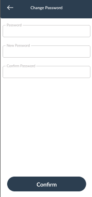

# Survay application for with Flutter and dart
 
## Features
* **Authentication**  
* **Caching network calls locally**
 * **Somalian and Engilish Language**

## File structure

    
    ├── lib
    │   ├── core  
    │   │  ├── helper 
    │   │  ├── models 
    │   │  ├── providers 
    │   │  ├── services 
    │   │── ui
    │   │  ├── constants
    │   │  ├── screens
    │   │  ├── utils
    │   │  ├── widgets
    │   ├── main.dart                  
     
 

 

 

